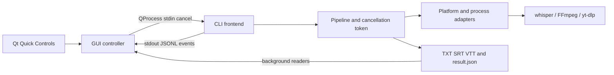

# Windows backend и GUI

Поддерживаются Linux и Windows 11 x64. CLI остаётся самостоятельной программой;
GUI на Qt Quick 6.8+ запускает отдельный CLI-процесс. macOS, очередь задач и tray
не входят в текущую реализацию. GUI использует стандартные Qt Quick Controls
со стилем Fusion и системной палитрой, одну текущую задачу и историю результатов.

## Сборка и запуск Linux

Для CLI нужны CMake 3.20+, компилятор C++23, FFmpeg и установленный whisper.cpp.
Для GUI дополнительно нужны CMake 3.24+ и Qt 6.8+ с Quick, QuickControls2, Network,
Concurrent и Test. Существующий `install.sh` устанавливает Linux CLI как прежде.
GUI собирается явно:

```sh
cmake -S . -B build-gui -DCMAKE_BUILD_TYPE=Release -DTRANSCRIBE_BUILD_GUI=ON
cmake --build build-gui --parallel
ctest --test-dir build-gui --output-on-failure
cmake --build build-gui --target all_qmllint
./build-gui/transcribe-gui
```

В дереве сборки GUI и CLI находятся рядом в `build-gui`. Для установки
используйте временный или пользовательский prefix:

```sh
cmake --install build-gui --prefix "$HOME/.local"
transcribe-gui
```

Команда GUI ищет CLI рядом со своим исполняемым файлом. На Linux Qt
и системные FFmpeg/yt-dlp остаются системными зависимостями. Desktop entry и SVG
устанавливаются под `share/applications` и `share/icons`. `TRANSCRIBE_HOME`
совместим с текущей установкой; по умолчанию это `~/.local/share/transcribe`.

## Сборка Windows ZIP

Нужны Windows x64, Visual Studio 2022 с C++ workload/Windows SDK, CMake 3.24+,
Git, Python 3 и официальный shared Qt 6.8.3 MSVC x64 SDK. В PowerShell:

```powershell
./scripts/package-windows.ps1 -QtRoot C:/Qt/6.8.3/msvc2022_64
```

Скрипт создаёт отдельный рабочий каталог, собирает приложение и тесты, выполняет
CTest, разворачивает Qt/QML, собирает закреплённый whisper.cpp, скачивает
закреплённые FFmpeg/yt-dlp с проверкой SHA-256 и запускает package smoke.
ZIP и его SHA-256 находятся в `dist`. `-WorkDirectory` и `-Destination` меняют
каталоги; `-SkipTests` предназначен для локальной диагностики и отмечается в
`package-manifest.json`. CI этот флаг не использует. CI сохраняет проверенный ZIP
как artifact, без публикации Release. Скрипт не обновляет установленную систему.

В ZIP есть `bin/transcribe-gui.exe`, `bin/transcribe.exe`, Qt DLL/QML/plugins,
`bin/tools/whisper-cli.exe` и CPU DLL, FFmpeg, yt-dlp, лицензии и манифест. Модели
скачиваются отдельно через GUI или импортируются из `.bin` с проверкой хеша.
Данные: `%LOCALAPPDATA%/Transcribe`; результаты: `%USERPROFILE%/Transcriptions`.
Для вывода выберите короткий путь: реализация резервирует место для имён файлов
в сторонних инструментах и отказывает родительским путям длиннее 169 UTF-16
единиц. Приложения имеют long-path и PerMonitorV2 manifests, без запроса elevation.

CPU-бэкенды whisper.cpp собираются с `GGML_NATIVE=OFF` и runtime dispatch;
ускорение CUDA/Vulkan не включено. Интеграционный патч проверяет SHA-256 трёх
исходных файлов закреплённой ревизии перед записью. Он переводит argv через
`wmain`, читает аудио через wide API, открывает экспорты через UTF-8 filesystem
paths и исправляет преобразование путей моделей/VAD для символов вне BMP.
Установленный Linux whisper.cpp скрипт не меняет.

Прежде чем распространять ZIP публично, подготовьте соответствующие исходники
фактически включённых LGPL/GPL компонентов; см. `packaging/windows/THIRD-PARTY.md`.
Нынешний source-only release workflow не публикует Windows ZIP автоматически.

## Границы архитектуры



`transcribe_core` не зависит от Qt. `pipeline.cpp` выполняет общие стадии и
публикует события через `EventSink`; CLI занимается отображением. Platform API
отделяет filesystem paths, блокировки, приватные каталоги и запуск процессов.
Linux сохраняет process groups/poll/flock. Windows использует `CreateProcessW`,
ограниченный список наследуемых handles, suspended launch и Job Object с
`KILL_ON_JOB_CLOSE`; работник начинает выполнение после присоединения к job.
Оба канала вывода осушаются, все работники останавливаются перед фиксацией ошибки.

Разделяемый cancellation token арбитрирует отмену и фиксацию успеха. Отмена до
commit оставляет рабочее аудио, частичный TXT и статус interrupted. После commit
сохранённый успех остаётся успешным, а cleanup становится best effort.
Обычные отмена GUI и Ctrl+C поддерживаются; аварийное выключение ОС и Windows
console-close не дают гарантий завершения записи. Принудительное завершение
неотвечающего backend через GUI после пяти секунд показывается как ошибка.

## Протокол и история

`--machine` выводит UTF-8 JSON Lines в stdout, stderr остаётся диагностическим.
Первое сообщение — `{"protocol":1,"type":"hello"}`. Далее идут `stage`, `result`,
`progress`, `warning`, `finalizing` и один терминальный `completed`/`failed`.
Каждая строка содержит `protocol` и `type`; пути абсолютны. Progress передаёт
`fraction`, `finished`, `total`, `eta_seconds` (число или null). Итог содержит
`status` и `code`. Узнаваемая речь через этот канал не передаётся.

```json
{"protocol":1,"type":"progress","fraction":0.5,"finished":1,"total":2,"eta_seconds":null,"result":"/absolute/result"}
```

GUI держит stdin открытым и посылает `{"type":"cancel"}\n`. EOF, повреждённая
команда и превышение лимита управляющего буфера трактуются как потеря связи;
до commit это interrupted с кодом 141. Явная отмена — interrupted/130. Help и
version сохраняют обычный CLI-вывод. Ошибки разбора параметров задачи machine
передаются структурированно. JSONL ограничен на стороне GUI; разделённые по
байтам UTF-8 сообщения собираются до декодирования.

Результат имеет атомарно заменяемый `result.json` версии 1 с source, title,
model, language, threads/chunks/jobs/vad, status/code и относительными путями
экспортов; прежний `source.txt` сохраняется. 100% распознавания ещё не означает
успех: GUI ждёт completed, нормальный выход CLI/0, completed/code=0 в манифесте
и наличие всех трёх итоговых экспортов. Затем отмечает задачу как готовую.

История сканирует выбранные каталоги в фоне, понимает legacy `source.txt` и
показывает удалённые известные результаты как недоступные. QSettings хранит
пути, модель и каталог вывода; cookies, prompt и распознанный текст не сохраняются в
настройках. `TRANSCRIBE_GUI_SETTINGS_FILE` позволяет явно выбрать отдельный INI
для изолированных проверок. Предпросмотр читает максимум 512 КиБ в фоне, полный TXT остаётся
на диске. Загрузчик моделей читает общий `scripts/models.tsv`, использует
`.install.lock`, проверяет SHA-256 в фоне и поддерживает `.part`/HTTP Range.
Повреждённая установленная модель сохраняется для ручного восстановления.

## GUI best practices, использованные в реализации

- Операции CLI идут через асинхронный QProcess; хеширование, импорт, история и
  предпросмотр выполняются вне GUI thread. QObject/QML обновляются в GUI thread.
- Стандартные Controls, layouts и системная палитра вместо ручных размеров
  кликабельных элементов; прокрутка при малом окне, native file/folder dialogs.
- Разделены состояние задачи, прогресс и подтверждённый результат; ошибки
  читаемы, отмена доступна, активное закрытие требует подтверждения.
- Keyboard navigation, accessible names и Ctrl+O/Ctrl+Enter/Ctrl+Q/F5. Текст
  пользователя, transcript и названия в истории показываются как PlainText.
- Изменения QML проверяются строгим qmllint и загрузкой настоящего окна;
  контроллер/протокол — независимыми fixtures, downloads — локальным HTTP server.

Первичные источники: [Qt GUI thread и worker objects](https://doc.qt.io/qt-6/threads-qobject.html),
[QProcess](https://doc.qt.io/qt-6/qprocess.html),
[Qt Quick best practices](https://doc.qt.io/qt-6/qtquick-bestpractices.html),
[Accessibility](https://doc.qt.io/qt-6/qtquick-accessibility.html),
[Qt Quick Controls styles](https://doc.qt.io/qt-6/qtquickcontrols-styles.html),
[QML deployment](https://doc.qt.io/qt-6/qt-deploy-qml-imports.html),
[Windows Job Objects](https://learn.microsoft.com/en-us/windows/win32/procthread/job-objects).

## Проверки и границы

Локально проверено 2026-10-04: Release-сборки с `-Werror` на GCC 16.2 и
Clang 23.1.1, Qt 6.11.2; в каждой прошли все 10 наборов CTest. Пройдены строгий
`all_qmllint`, clang-tidy всех 29 проектных translation units, ShellCheck,
проверка синтаксиса Python и разбор упаковщика
PowerShell 7.5.3. Установка в отдельный `/tmp` prefix и двухсекундный запуск
установленного GUI с offscreen/software backend прошли без stderr-диагностики.
Windows CLI и native fixtures кросс-компилированы LLVM-MinGW 20260922 с
`-Werror`; Windows GUI и ZIP локально не запускались. Минимальная Qt 6.8.3
проверяется добавленными заданиями CI, а не этим локальным прогоном.

CTest включает прежние Linux suites, независимый Python JSONL harness,
переносимые process/filesystem проверки, GUI controller/download tests и QML
window/focus tests. Windows CI строит CLI с MSVC, проверяет native job descendants,
собирает Qt ZIP и запускает его с очищенным PATH из Unicode-каталога.
Локальный HTTP server в тестах требует разрешения на локальные сокеты.

Локальная кросс-сборка Windows подтверждает компиляцию CLI и fixtures, но не
заменяет их выполнение с MSVC на Windows. Windows GUI/ZIP и реальное
распознавание установленной модели требуют отдельного runtime smoke на Windows;
не следует считать добавление workflow доказательством успешного CI.
